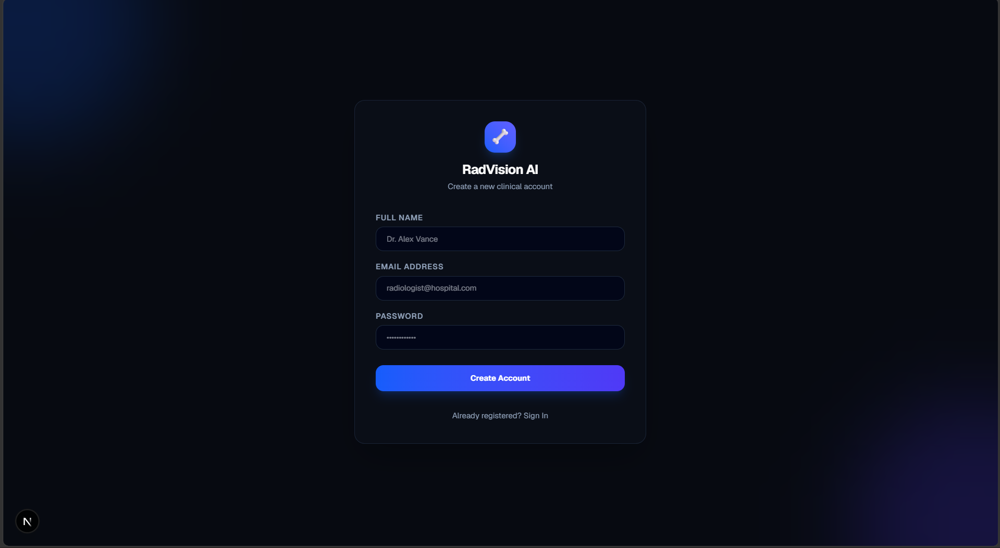
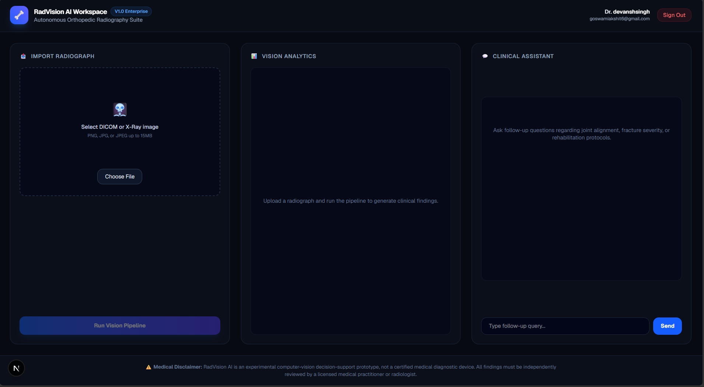

# 🦴 RadVision AI | Autonomous Orthopedic Radiography Suite

A modern, full-stack AI-powered medical web application designed for real-time orthopedic X-ray visual analysis, secure clinician authentication, and interactive diagnostic support using local multimodal LLMs.

---

## 🌟 Architectural Features

* **Decoupled Architecture:** Built with a modern **FastAPI** backend server (Python) and a high-performance **Next.js 14** web frontend (TypeScript + Tailwind CSS).
* **Secure Local Authentication:** Asynchronous MongoDB persistence (`motor`) paired with native `bcrypt` password hashing and client-side session protection.
* **Local AI Vision Engine:** Powered by **Ollama** running the multimodal `llava` vision model locally for complete data privacy.
* **Fallback Safety Engine:** Automatic offline detection that gracefully switches to mock structured data if local AI models are unavailable.
* **Interactive Diagnostic Workspace:**
  * Multi-metric telemetry (Anatomical Region, Image Quality, Confidence Scoring).
  * Identified Indications & Abnormalities breakdown.
  * Context-aware Radiology Summary Narrative.
  * Follow-up clinical assistant chat interface.

---

## 🛠️ Tech Stack

* **Frontend:** Next.js 14 (App Router), React, TypeScript, Tailwind CSS
* **Backend:** Python 3.10+, FastAPI, Uvicorn, Pydantic, Motor (Async MongoDB Driver), Bcrypt
* **Database:** MongoDB (Local Instance)
* **AI Engine:** Ollama (`llava` 7B vision model)

---

## 📸 Application Screenshots

### 🔐 Clinician Authentication


### 🦴 Diagnostic Dashboard Workspace


---

## 📁 Repository Structure

```text
bone-xray-assistant/
├── backend/                  # FastAPI Python Backend
│   ├── main.py               # REST API Endpoints (/api/auth, /api/analyze, /api/chat)
│   ├── database.py           # Async Motor MongoDB Connection
│   ├── ai_agent.py           # Core Vision Agent & Ollama Integration
│   ├── requirements.txt      # Python Dependencies
│   └── uploads/              # Local Storage for Analyzed Radiographs
│
└── frontend/                 # Next.js 14 Frontend Client
    ├── app/
    │   ├── page.tsx          # Production Medical Dashboard Layout
    │   ├── login/
    │   │   └── page.tsx      # Obsidian Glassmorphism Auth Page
    │   ├── globals.css       # Tailwind Styles & Obsidian Dark Theme
    │   └── layout.tsx
    ├── package.json
    └── tailwind.config.ts
